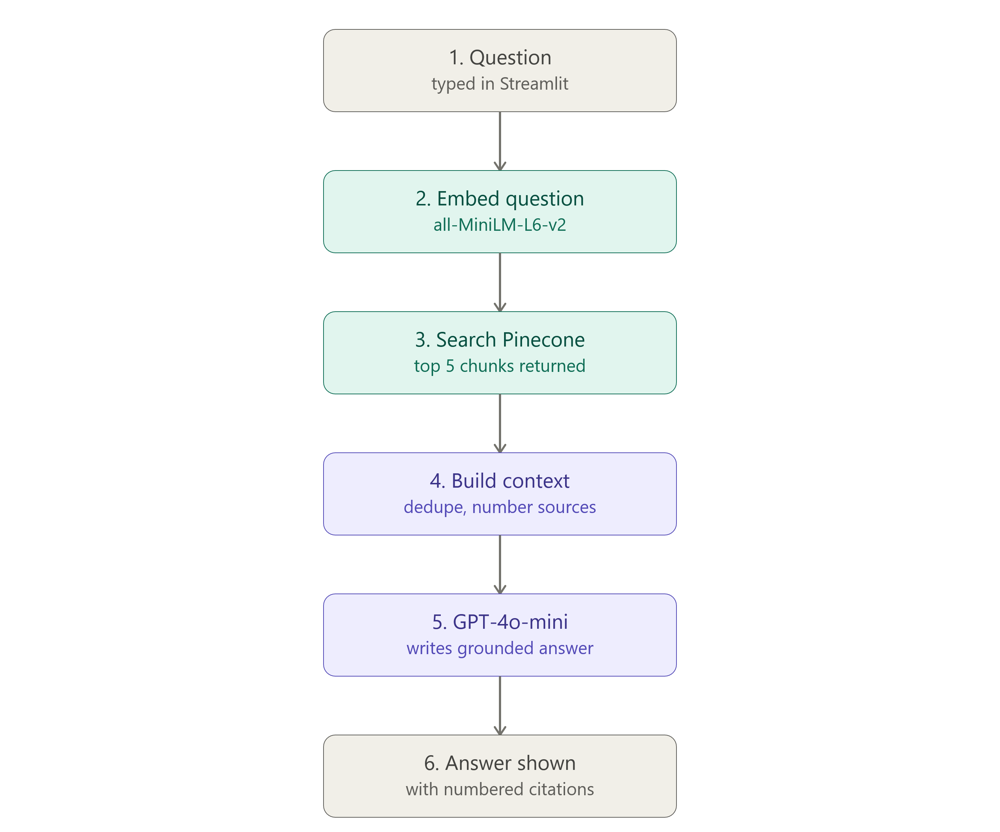

# Building EpiRAG: A Retrieval-Grounded Methodology Advisor for Epidemiological Research

## The Problem

Causal inference is one of the hardest things to get right in observational research, and one of the easiest to get wrong quietly. Junior researchers and non-statisticians routinely misclassify their own study (causal vs. descriptive), adjust for the wrong variables, misread a p-value, or claim causation their design doesn't support. Not from carelessness: the methodology literature that would catch these mistakes is dense, scattered across journals, and not written for a quick sanity check mid-analysis.

EpiRAG is a retrieval-augmented system that lets a researcher ask a specific methodological question about their own study and get a grounded, cited answer drawn from peer-reviewed epidemiological methodology literature. Not a generic LLM opinion, but a synthesis of what the actual literature says, with sources attached.

## Architecture Decisions

**RAG over fine-tuning, deliberately.** The whole point is that answers need to be traceable to a source a researcher can go verify. A LangGraph two-node pipeline (retrieve, then synthesize) keeps this simple: embed the question, pull the top-k chunks from a vector index, then have an LLM synthesize a grounded answer with a strict system prompt (answer only from retrieved passages, cite every claim, say "I don't have enough information" rather than fill gaps).

**How the pipeline actually runs.** A question comes in through the Streamlit frontend and hits a two-node LangGraph state graph:

1. **Retrieve node.** The question is embedded with a sentence-transformers model (`all-MiniLM-L6-v2`), queried against the Pinecone index, and the top-5 chunks come back with their metadata (source citation, authors, year, topic, similarity score).
2. **Synthesize node.** The retrieved chunks are deduplicated by source (so a paper that contributed 3 chunks gets one citation number, not three), assembled into a numbered context block, and passed to GPT-4o-mini with a system prompt that enforces grounding: cite every claim to a numbered source, flag gaps instead of guessing, never run statistics or touch the researcher's actual data.

The graph terminates after synthesis and returns the answer plus a deduplicated, short-form citation list to the frontend. State is just a typed dict carried between the two nodes: question in, chunks in the middle, answer and citations out. Simple enough to reason about, which matters more than it sounds once you're debugging why a specific citation didn't show up.

**Pinecone instead of a local vector store.** The original build used ChromaDB, which stores raw chunk text in a SQLite file. Fine locally, but a problem the moment that file gets committed to a public GitHub repo. Pinecone keeps the vectors and chunk text in a private, API-key-gated cloud index, and the repo itself stays code-only. The application never needs local access to source PDFs after ingestion.

## Evaluation

A deployed RAG system that hasn't been evaluated is a demo, not an engineering artifact. I built a DeepEval harness: an LLM synthesizer generated 27 candidate questions from the corpus (3 per paper), and I scored the live pipeline's answers against five metrics: Faithfulness, Contextual Precision, Contextual Recall, Answer Relevancy, and Hallucination.

Results: Faithfulness 0.95, Answer Relevancy 0.98, Contextual Precision 0.82, Contextual Recall 0.77, Hallucination 0.27 (lower is better on this one). I re-ran the full evaluation independently to check stability. Scores held within about 1.5 points across both runs, which mattered more to me than either run individually. A number that doesn't replicate isn't a finding.

## What Breaks, and What I'd Do Differently

**Contextual Recall is the real weak point.** Faithfulness and Relevancy are strong because the system is conservative: it doesn't say much it can't support. Recall is lower because the top-k retrieval sometimes misses a relevant passage that exists elsewhere in the corpus, especially on multi-part questions. That's a retrieval tuning problem, not a synthesis problem, and it's the next thing I'd actually fix rather than just measure.

**A specific, recurring failure mode worth naming.** The system occasionally takes a real, source-supported methodological point and states it more absolutely than the source does, turning "a variable is usually a confounder under X" into "a variable is only a confounder under X." Not a fabrication, an overconfidence pattern, and a genuinely interesting one, since it's a known LLM tendency (preferring clean rules over hedged ones) showing up concretely in a domain where that overconfidence has real cost.

**I also shipped a bug worth admitting to.** My first pass at saving evaluation results assumed DeepEval's parallel test execution preserved input order. It doesn't. Scores were correct; the questions attached to them in the saved output weren't. Caught it by actually reading the output rather than trusting the aggregate numbers, which is the whole argument for spot-checking eval output instead of just reporting means.

**The honest scope limit.** The gold-standard question set is currently LLM-generated and hasn't been reviewed by a domain expert. The numbers above are a real, reproducible pilot signal, not yet a validated benchmark. Closing that gap, with a methodology expert reviewing the question set, is the clear next step if this evaluation needs to support a stronger claim than "the system is consistently faithful to its sources on a 27-question pilot."